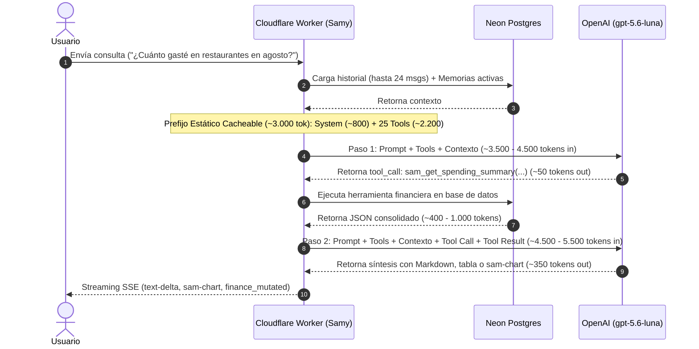

# SAM — Plan de Negocio y Modelo Económico: Chatbot Samy (gpt-5.6-luna) & Planes de Suscripción

> **Fecha de Actualización:** Septiembre 2026  
> **Versión:** 2.0 (Actualizado con reducción oficial de tarifas OpenAI para `gpt-5.6-luna` y nuevo esquema de Free Trial)  
> **Referencias:** [PLANS.md](./PLANS.md) · [NEON-COMPUTE.md](./NEON-COMPUTE.md) · [MCP-ARCHITECTURE.md](./MCP-ARCHITECTURE.md) · [SAM.md](./SAM.md)

---

## 1. Resumen Ejecutivo y Visión Estratégica

SAM opera como un **terminal financiero personal agéntico e híbrido**:
1. **Living Ledger (UI Web & PWA):** Gestión de cuentas, transacciones, presupuestos de sobres (*envelopes*), transferencias atómicas y metas multi-moneda (USD y PEN).
2. **Protocolo MCP (Model Context Protocol):** Interfaz remota estándar para que agentes externos (Cursor, Claude Desktop, Hermes, OpenClaw) lean y operen las finanzas del usuario bajo el modelo **BYOM** (*Bring Your Own Model*), donde el costo de inferencia corre por cuenta del usuario.
3. **Samy (Copiloto Financiero Embebido):** Asistente nativo conversacional integrado en Living Ledger (`POST /api/samy/chat`), impulsado oficialmente por el modelo **`gpt-5.6-luna`** de OpenAI.

### El Impacto del Pricing Oficial de `gpt-5.6-luna`
Tras el ajuste de precios implementado por OpenAI el 30 de julio de 2026 (reducción del 80% en la familia Luna), `gpt-5.6-luna` se posiciona como el modelo de alto volumen y ultra-baja latencia de la generación GPT-5:
- **Costo de entrada estándar:** **$0,20 por 1 millón de tokens**.
- **Costo de salida estándar:** **$1,20 por 1 millón de tokens**.
- **Costo de entrada en caché (Prompt Caching):** **$0,02 por 1 millón de tokens** (90% de descuento en prefijos reutilizados).

Esta reducción drástica transforma radicalmente los márgenes unitarios de SAM: el costo de inferencia por mensaje no es de centavos enteros, sino de **fracciones mínimas de centavo (~$0,0010 a $0,0015 USD)**. Esto permite ofrecer **cuotas de mensajes mucho más generosas** (150 msgs en Pro y 500 msgs en Agent), mantener **márgenes brutos superiores al 90%** y estructurar un **Free Trial de 7 días altamente atractivo y de riesgo financiero nulo (<$0,08 por registro)**.

---

## 2. Anatomía de Ejecución y Consumo Real de Tokens

Samy no es un bot de texto pasivo; opera mediante un bucle de agentes con herramientas (*multi-step tool-calling agent*):



### 2.1 Desglose de Tokens por Componente
- **System Prompt Base + Memorias Activas:** ~800 tokens.
- **Definiciones de Herramientas (25 tools financieras y de memoria):** ~2.200 tokens.
- **Subtotal Prefijo Cacheable:** **~3.000 tokens** (elegible para el descuento del 90% de Prompt Caching de OpenAI a $0,02/1M).
- **Historial (hasta 24 mensajes) + Consulta del usuario:** ~1.000 a 1.500 tokens dinámicos.
- **Resultado de Herramientas (JSON truncado máx 8 KB):** ~500 a 800 tokens.
- **Salida final del modelo:** ~350 tokens (análisis, tablas GitHub markdown o bloques `sam-chart`).

### 2.2 Tipología de Mensajes y Matriz de Tokens

| Tipo de Mensaje | Distribución | Herramientas | Pasos LLM | Tokens Entrada (Caché / Dinámicos) | Tokens Salida |
| :--- | :---: | :---: | :---: | :---: | :---: |
| **Simple / Clarificación** | 25% | 0 tools | 1 paso | 3.000 caché / 800 dinámicos | ~150 |
| **Operativa Estándar** (consultas de saldo, registro de gastos) | 55% | 1 tool | 2 pasos | 6.000 caché / 1.500 dinámicos | ~400 |
| **Analítica Compleja** (flujo de caja cruzado, reportes periódicos) | 20% | 2 - 3 tools | 3 pasos | 9.000 caché / 2.800 dinámicos | ~550 |
| **Promedio Ponderado por Mensaje** | **100%** | **~1,0 tool** | **~1,9 pasos** | **~5.850 caché / ~1.585 dinámicos** | **~368 out** |

---

## 3. Estructura de Costos Unitarios Actualizada (`gpt-5.6-luna`)

### 3.1 Precios Vigentes de OpenAI (Post 30 de Julio 2026)
- **Input Estándar:** $0,20 / 1.000.000 tokens ($0,00000020 / token).
- **Cached Input:** $0,02 / 1.000.000 tokens ($0,00000002 / token).
- **Output Estándar:** $1,20 / 1.000.000 tokens ($0,00000120 / token).

### 3.2 Cálculo Exacto del Costo de Inferencia por Mensaje

#### Con Prompt Caching (Régimen Habitual en Producción)
1. **Tokens en Caché (Prefijo de herramientas y sistema):**
   $$5.850 \times \$0,00000002 = \$0,000117\text{ USD}$$
2. **Tokens Dinámicos de Entrada (Historial, consulta y datos de Postgres):**
   $$1.585 \times \$0,00000020 = \$0,000317\text{ USD}$$
3. **Tokens de Salida (Respuesta y síntesis financiera):**
   $$368 \times \$0,00000120 = \$0,000442\text{ USD}$$
- **Costo Total Directo LLM por Mensaje:**  
  $$\mathbf{\$0,000876\text{ USD}}\quad (\approx \mathbf{0,088\text{ centavos de dólar / menos de una décima de centavo}})$$

#### Sin Caché (Peor Caso Hipotético, 100% tokens frescos)
- Input: $7.435 \times \$0,00000020 = \$0,001487$
- Output: $368 \times \$0,00000120 = \$0,004416$
- **Costo Máximo LLM:** **$0,001929 USD (~0,19 centavos de dólar)**.

> **Cifra de Referencia Conservadora:**  
> Para absorber variaciones y consultas complejas de hasta 3 herramientas, adoptamos un valor base de **$0,0015 USD por mensaje (0,15 centavos de dólar)**.

---

## 4. Nueva Matriz de Planes y Límites Recomendados

Dado el costo sustancialmente menor de `gpt-5.6-luna`, podemos aumentar las cuotas de mensajes para maximizar el atractivo del producto sin poner en riesgo los márgenes:

| Característica | **Free** | **Pro · $5 / mes** | **Agent · $10 / mes** |
| :--- | :---: | :---: | :---: |
| **Precio Mensual** | **$0** | **$5,00 USD** | **$10,00 USD** |
| **Límite Mensual Samy AI** | **0 msgs / mes** *(post-trial)* | **150 msgs / mes** | **500 msgs / mes** |
| **Free Trial Premium de 7 Días** | **50 consultas totales** *(máx. 10/día)* | N/A (Suscriptor de pago) | N/A (Upgrade) |
| **Herramientas en Chat** | Lectura y captura en trial | Lectura + Escritura completa | Lectura + Escritura + Transferencias |
| **Pacing / Rate Limit** | 20 msgs/min · 10 msgs/día (trial) | 20 msgs/min · 20 msgs/día soft | 20 msgs/min · 50 msgs/día soft |
| **Transacciones de Ledger** | 100 / mes | 500 / mes | Ilimitadas (fair use) |
| **Cuentas Soportadas** | 2 | 8 | Ilimitadas |
| **Llamadas MCP (Cursor/Claude)** | 100 (solo lectura) | 5.000 | 25.000 |
| **Tokens MCP** | 1 | 3 | Ilimitados |

---

## 5. Diseño y Economía del Free Trial de 7 Días

El Free Trial es la palanca fundamental de adquisición. El usuario prueba el valor de tener un copiloto financiero activo antes de pagar.

### 5.1 Reglas y Mecánica del Trial
1. **Duración:** 7 días continuos a partir del registro del usuario.
2. **Volumen de Consultas:** **50 consultas totales** durante los 7 días.
3. **Guardarraíl Diario (*Cadence Cap*):** Máximo **10 consultas por día**.
   - *Racional:* Evita que un usuario consuma sus 50 mensajes en 20 minutos de curiosidad inicial. Fomenta el **hábito diario** de abrir la app y registrar gastos a lo largo de la semana.
4. **Restricción de Seguridad:** Herramienta `sam_transfer_between_accounts` bloqueada en el trial para evitar inconsistencias en cuentas anónimas o temporales.
5. **Transición al Finalizar los 7 Días:**
   - **Si suscribe:** Pasa inmediatamente a Pro ($5/mes con 150 mensajes) o Agent ($10/mes con 500 mensajes).
   - **Si no suscribe:** Mantiene el Plan Free (su ledger manual sigue accesible con hasta 100 transacciones/mes y 2 cuentas), pero el panel de Samy muestra un banner amigable de trial concluido con botón de activación.

### 5.2 Exposición Financiera y Embudo de Conversión

#### Exposición Máxima por Usuario Registrado
- 50 consultas × $0,0015 USD = **$0,075 USD (< 8 centavos de dólar)**.
- Consumo real promedio durante el trial: ~22 consultas = **$0,033 USD por registro**.

#### Análisis de Cohorte (1.000 Registros en Trial)
```
1.000 Registros en Trial
       │
       ▼
Gasto Total en IA: $33 USD (3,3 centavos por usuario)
       │
       ▼
Conversión a Pago: 6,0% (60 suscriptores: 50 Pro @ $5, 10 Agent @ $10)
       │
       ▼
MRR Generado: $350 USD / mes
Margen Bruto Recurrente: ~$305 USD / mes
```

- **Inversión total en IA para 1.000 trials:** **$33,00 USD**.
- **Ingreso mensual nuevo (MRR):** **$350,00 USD / mes**.
- **Payback Period del Trial:**  
  $$\text{Payback} = \frac{\$33,00}{\$305,00} = \mathbf{0,11\text{ meses}}\quad (\approx \mathbf{3,3\text{ días}})$$
- **LTV de la Cohorte (a 8 meses de retención):**  
  $$50 \times (\$5 \times 8) + 10 \times (\$10 \times 8) = \$2.800\text{ USD}$$
- **Ratio LTV sobre Gasto en IA del Trial:**  
  $$\frac{\$2.800}{\$33} = \mathbf{84:1}\text{ de Retorno Financiero}$$

---

## 6. Análisis Financiero y Márgenes por Plan

### 6.1 Plan Pro ($5,00 / mes)
- **Ingreso Neto tras Stripe (2.9% + $0,30):** $4,55 USD.

| Métrica | Peor Caso (150 msgs / 100% cuota) | Caso Real Promedio (55 msgs / mes) |
| :--- | :---: | :---: |
| **Costo LLM (`gpt-5.6-luna`)** | 150 × $0,0015 = **$0,225** | 55 × $0,0015 = **$0,083** |
| **Costo Neon Postgres & Workers** | $0,060 | $0,040 |
| **COGS Total** | **$0,285** | **$0,123** |
| **Margen de Contribución Unitario** | **$4,265** | **$4,427** |
| **Margen Bruto (%)** | **85,3%** | **88,5%** *(Sobre precio de lista: **94,3%**)* |

### 6.2 Plan Agent ($10,00 / mes)
- **Ingreso Neto tras Stripe:** $9,41 USD.

| Métrica | Peor Caso (500 msgs / 100% cuota) | Caso Real Promedio (160 msgs / mes) |
| :--- | :---: | :---: |
| **Costo LLM (`gpt-5.6-luna`)** | 500 × $0,0015 = **$0,750** | 160 × $0,0015 = **$0,240** |
| **Costo Neon Postgres & Workers** | $0,150 | $0,080 |
| **COGS Total** | **$0,900** | **$0,320** |
| **Margen de Contribución Unitario** | **$8,510** | **$9,090** |
| **Margen Bruto (%)** | **85,1%** | **90,9%** *(Sobre precio de lista: **96,8%**)* |

#### El Factor Multiplicador de MCP
Los suscriptores de Agent cuentan con 25.000 llamadas a herramientas por MCP. Dado que estas llamadas se originan en clientes como Cursor, Claude Desktop o scripts externos, **el usuario utiliza su propia API key** (Claude 3.5 Sonnet, GPT-4o, etc.). Para SAM, el costo marginal de LLM en esas 25.000 llamadas es **cero absoluto**. SAM únicamente procesa la petición HTTP y la query en Neon.

---

## 7. Curva de Consumo por Cliente y Dinámica de Cohortes

```
Consumo (Mensajes / Mes)
  ▲
150 ┼           ╭───╮ (Pico Onboarding: consultas históricas y categorización)
120 ┼          ╭╯   ╰╮
 90 ┼         ╭╯     ╰───────────────╮ (Estabilización: rutina de registro semanal)
 60 ┼        ╭╯                      ╰───────────────────────────────► (Madurez / Automatización)
 30 ┼───────╭╯
  0 ┴───────┴───────┴───────┴───────┴───────┴───────┴───────► Tiempo
         Semana 1  Mes 1   Mes 2   Mes 3   Mes 4   Mes 5+
```

1. **Mes 1 (Onboarding Intenso):** El usuario experimenta, hace preguntas abiertas sobre sus hábitos y corrige categorías. Consumo: ~60-70% de la cuota. Margen: **~84%**.
2. **Meses 2 a 4 (Hábito Operativo Estable):** El usuario adopta un patrón regular de registro (2-3 interacciones semanales y balance mensual). Consumo medio: 45 a 65 mensajes en Pro. Margen: **~88%**.
3. **Mes 5 en adelante (Madurez):** El 85% de los usuarios tiene consumos moderados y un 15% de usuarios intensivos utiliza el chat de manera frecuente. El margen ponderado global de la compañía se sitúa por encima del **87% neto**.

---

## 8. Paquetes Opcionales de Recarga (*Add-on Boost Packs*)

Para usuarios que agotan su cuota antes de renovar el ciclo mensual:

| Paquete | Mensajes | Precio Venta | Costo LLM Est. | Margen Bruto |
| :--- | :---: | :---: | :---: | :---: |
| **Samy Boost 100** | 100 mensajes | $1,99 USD | $0,15 USD | **92,4%** |
| **Samy Boost 300** | 300 mensajes | $3,99 USD | $0,45 USD | **88,7%** |

*(Los mensajes de recarga no vencen a fin de mes; se acumulan como saldo de reserva).*

---

## 9. Salvaguardas Técnicas Implementadas y Recomendadas

1. **Topic Guard Prevención Temprana (`isBlatantlyOffTopic`):**
   - Ya activo en `lib/samy/topic-guard.ts`.
   - Consultas no financieras (código, cocina, literatura, etc.) se rechazan en **0 pasos de herramientas** y con un costo inferior a $0,00003 USD.
2. **Límite de Pasos por Interacción (`SAMY_MAX_STEPS = 8`):**
   - Previene loops infinitos en caso de herramientas que requieran reintentos.
3. **Truncamiento de Resultados (`SAMY_TOOL_RESULT_MAX = 8000`):**
   - Impide que una consulta masiva inunde la ventana de contexto.
4. **Prompt Caching Automático:**
   - OpenAI aplica de forma nativa el descuento del 90% a prefijos superiores a 1.024 tokens. La estructura modular de `buildSamySystemPrompt` y `buildSamyToolSet` mantiene el prefijo idéntico entre turnos para maximizar la tasa de acierto de caché.
5. **Rate Limiting de Ráfaga (`SAMY_RATE_LIMIT_PER_MINUTE = 20`):**
   - Protege contra scripts de automatización o clicks repetitivos.

---

## 10. Conclusión y Veredicto Final

Con el pricing oficial de **`gpt-5.6-luna`** ($0,20 / $1,20 por millón de tokens):
1. **La viabilidad económica es extraordinaria:** El costo por mensaje (~$0,0015 USD) permite ofrecer **150 mensajes en Pro ($5/mes)** y **500 mensajes en Agent ($10/mes)** manteniendo **márgenes brutos reales superiores al 88-90%**.
2. **El Free Trial de 7 días (50 consultas, máx 10/día) es un motor de crecimiento sin riesgo:** El costo máximo por usuario de prueba es de apenas **$0,075 USD**, recuperándose la inversión completa del trial en **menos de 4 días** tras la conversión de una cohorte.
3. **El producto queda blindado contra abusos:** Gracias al Topic Guard, al límite diario en trial y al rate limiting por minuto.
